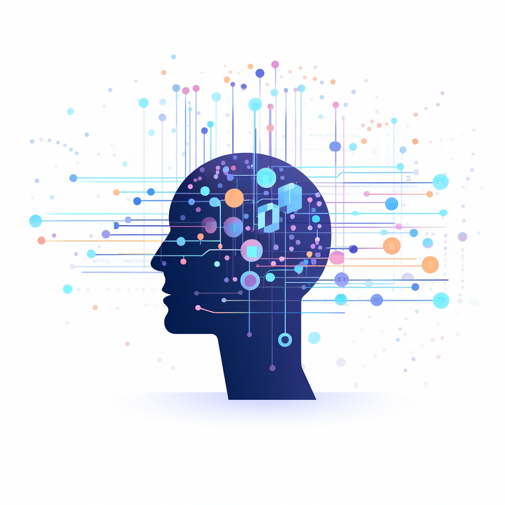
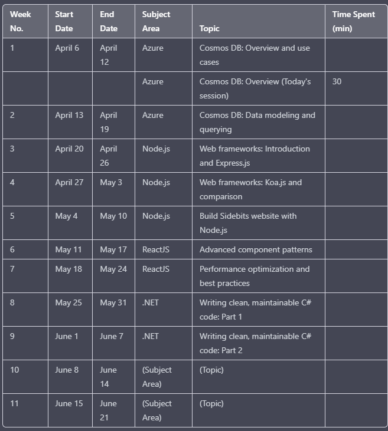
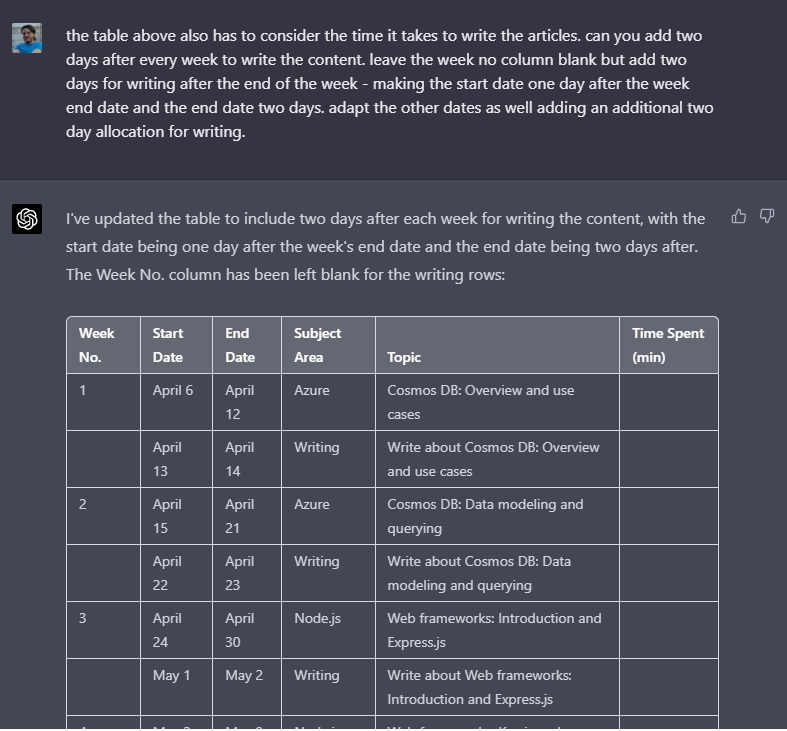

# How I used ChatGPT to help me come up with a basic personal growth plan

## Introduction

It really feels like the emergence of ChatGPT has been a big turning point, well for me personally at least. It feels like it will shape things differently in how they are done in the future compared to the past. I honestly feel failing to adapt to the changes something like ChatGPT brings will leave you far behind. I am probably already very far behind - all I know is if you keep doing things the same way for too long you will not grow. I'm not saying you will become irrelevant in your job but I have seen how a business, for instance, kept things the same for too long and ended up closing. You have two choices - embrace change or ignore it. You also have to realise life is hard. Life is unpredictable. Life itself is a force you cannot box in to make it "more balanced". 

I have chosen to embrace ChatGPT - not that I know how to use it to its fullest extent yet. But I got my hands dirty and tried to learn. The thing that strikes me the most is how it allows me to adapt the way I learn - I feel this aspect is the single-most valuable outcome. 

## There are risks - never just copy and paste code. Or copy code from a place you shouldn't

Before I go any further I think its important to note a few things. The first rule I go by is to never simply copy and paste code from ChatGPT - similar to how you shouldn't, as a developer, simply copy and paste something from StackOverflow. The reason is quite simple - blindly accepting something to work you have not taken the time and effort to understand will come back at you at some point. Why take shortcuts? You can use code from StackOverflow, or ChatGPT, to learn from. Take the time to work through it. ChatGPT excels when you can ask it continuous questions about something. Lets say you asked it for an example of a Btree implementation in C# - it would make sense to understand what a Btree is first before moving further. It would also make sense to understand a Btree's specific use case. You can ask ChatGPT to expand on aspects of an answer as you go along. In most cases I have been able to ask it "follow up" questions on parts I need more clarity on. On a sidenote - I got to the Btree aspect as a result of asking questions about CosmosDB. As tempting as it may seem do not simply copy code. Also do not copy code from a codebase you have access to and ask ChatGPT to refactor it - ChatGPT will use the data you provide to continue training its models. I would rather use it to explore concepts in my own way. You never know where the code you give ChatGPT might end up. Having a thorough understanding of something will benefit you in the long term. Use ChatGPT to expand on the explanation of a piece of code. Try and frame questions in your own mind by asking clarifying questions. ChatGPT is great at helping you conceptually unpack things. I find myself asking it an initial question - when I get the response I look at the key phrases and ask it to expand further. Typically I would then conjure up questions in my mind when I'm away from the laptop - it makes me think and ponder about things. How does X work? How does Y fit into the picture? Having a tool like ChatGPT at your disposal makes information competely customizable to your own style of comprehension and understanding. I love writing so it makes me happy to type out stuff using my view on it and getting a response confirming my understanding. I will never use ChatGPT to write content for me - I would not let artificial intelligence replace my particular way of seeing things. Writing is a creative outlet. I could, however, use it as a sounding board to confirm my understanding of a particular topic. If it can reasonably respond with an understanding of my ramblings then at least I know I am on the right track. But to ask it to write my content for me will rob me of the joy and passion I get out of writing it myself. Its important to also state that life is more fulfilling when you do not take shortcuts. Expecting immediate gratification is temporary - building something bit by bit and seeing the progress is way more satisfying. I have realised perfection is a waste of effort - progress is way more valuable. Reflecting on your progress over time is very rewarding. Even ChatGPT requires time and effort to use. 

## A personal use case using ChatGPT

So I used ChatGPT to help construct a personal development plan - a Growth Plan. I asked it to calculate the number of work days available in 2023, considering the public holidays for South Africa. It was able to tell me there were 37 weeks (and a bit) left in 2023. At this point I feel the information I am giving it is not too personal. If it can be used to benefit someone else so be it. 

> how many work days are left in 2023 if you consider South African public holidays

> As of April 6th, 2023, there are 264 days remaining in the year. To calculate the number of workdays left in 2023, we need to consider > weekends and South African public holidays.
> 
> Here is a list of the remaining public holidays in South Africa for 2023:
> 
> Good Friday - April 7
> Family Day - April 10
> Freedom Day - April 27
> Workers' Day - May 1
> Youth Day - June 16
> National Women's Day - August 9
> Heritage Day - September 24
> Day of Reconciliation - December 16
> Christmas Day - December 25
> Day of Good Will - December 26
> There are 37 weekends remaining in 2023 (74 weekend days), and 10 public holidays. Some holidays might fall on weekends, and in such cases,  the following Monday is usually considered a public holiday.
> 
> For 2023, the following holidays fall on weekends and will be observed on the subsequent Monday:
> 
> Youth Day - June 16 (Saturday) -> observed on June 19 (Monday)
> Heritage Day - September 24 (Sunday) -> observed on September 25 (Monday)
> Day of Reconciliation - December 16 (Saturday) -> observed on December 18 (Monday)
> So, considering weekends and public holidays, there are:
> 
> 264 days (total days remaining) - 74 weekend days - 10 public holidays + 3 holidays observed on Monday = 183 workdays left in 2023, > considering South African public holidays.

Then I asked it to calculate the number of weeks left in 2023, something I could have done myself but it feels like a lot of effort. I'm all for not taking shortcuts - but being clever about making a repetitive task easier is not about taking shortcuts. Why am validating myself like this? 

> As of April 6th, 2023, there are 264 days remaining in the year. To calculate the number of weeks left, simply divide the remaining days by 7:
>
> 264 days / 7 days per week = 37.71 weeks
>
> Since you cannot have a fraction of a week, there are 37 full weeks left in 2023, with an additional 5 days beyond those weeks.

Wow! Super useful. Immediatelly it places a timeframe on my personal growth plan. It forces me to think realistically about the time I have left in the year. I started out the year with a growth plan but in all honesty I kind of let it slip. But I really have a desire to be a lot more intentional in my life.

Given the output from ChatGPT I decided to use it as a basis for defining my technicall skills growth plan. One of my personal goals is to write about the technology I am learning. More than that I also want to get to a point where I consistently do small bits of learning everyday - 30 to 60 minutes daily. I want to write about what I learned once a week - it gives me 37 pieces of writing for 2023. The writing also needs to follow a plan - I cannot simply write in a haphazard manner, picking one topic the one week and then something completely different the next. Consistency is my goal in life. The writing has to follow a specific, planned approach. I identified the core technologies I wanted to focus on for 2023 - Azure Services, .NET, ReactJS and NodeJS. Azure is an important part of my day-to-today work - I use it everywhere. I also use C# and .NET everyday - I have been using it for a very long time. ReactJS is a technology I have been using for the last 5 months or so, having primarily used Angular prior. I feel it will be worthwhile to focus a lot of my energy and attention on ReactJS as well. Finally I have also identified NodeJS as a technology I want to learn more about. I would like to use NodeJS for personal projects or little pieces of throw away code - I do not want to simply revert to the safety of .NET for everything I do in a personal capacity. Being able to think in more than one framework or programming language will benefit me greatly in the long term. I feel throw away code can add a lot of value if its just to embed a concept - its not a piece of code you would necessarily grow into something more complete or meaningful. Its simply about creating an understanding.

I used the focus areas and asked ChatGPT to assist me in creating a plan for learning these technlogies in 2023. It suggested I break down my technical writing. I found it useful - and for the moment I will use the approach. 

- 10 articles on .NET
- 10 articles on Azure
- 10 articles on ReactJS
- 7 articles on Node.js

The important thing about a growth plan is it must be measurable - you have to measure your progress. A growth plan must also be flexible - you cannot layout your goals for 2023 in a brittle way. Life will throw curve balls at you. But at least I have a target - to write 37 pieces on the technologies I use. The next step was to break down the writing into two week cycles - for two weeks I focus on Azure, then write something. For the next two weeks its .NET, write something, etc. It provides me with a plan. Instead of writing in a hit and miss fashion. Being focused is very important. But it also allows me to focus on a variety of technologies. The key to making all this work is to commit to and execute on the daily 30 to 60 minute learning. I have to remember - its not about perfection. Progress is the key. So even if I do not know a lot about Cosmos DB after two weeks I will have known more than I did the previous two weeks. 

So I asked ChatGPT to render a table for me containing the weeks and the subject area. 

I was not quite finished yet. I then asked it to amend the table several times - and this is the part that makes it such a great experience. At each conversation point it knows I referred to the table. Just think how the time it would have taken me to manually edit and update the table in Markdown.

I then asked it to render to the table to accommodate for the time needed to write the articles. I want to give myself two days to write the content. It happily updated the table. 

Great! But what does this mean? For me personally I have created a very basic development plan for myself for the rest of the year. I can revisit the structure of it and make amendments as needed. But the real benefit I had was using ChatGPT to understand my requirements. It was able to render meaningful content. I'm not advocating the approach I used in the example for everyone, merely sharing an experience.

