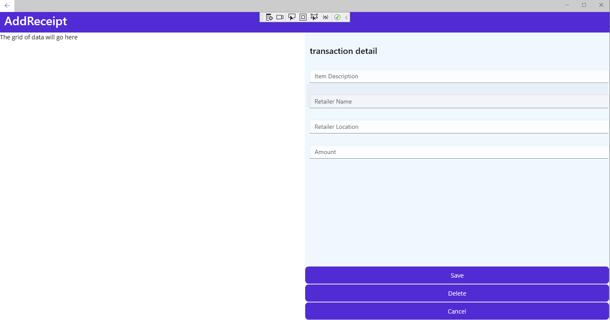

# Styling your .NET MAUI App

## It all starts somewhere

So I want to write a small application using .NET MAUI. The application will run on Windows - I'm not going down the road of getting it to run on Android as yet. I personally feel a .NET MAUI app can be a replacement for a WinForms application. Why not right? So my idea for an application is to capture transaction details from my trips to the shop. I think it could be interesting to build up a dataset of shopping trips over an extended period of time. I am calling it ConsumerAgent.

So to start I'll create two pages in my .NET MAUI app - a page to list the most recent retailer trips as well. The second page will allow me to capture the transactions.

I created a basic wireframe just to aid my planning of the application. It helps thinking up front just a bit. It doesn't have to be pretty to be effective.

The purpose of the application is to learn about the features of .NET MAUI - bit by bit. So as I go along I can create features using specific parts of .NET MAUI. The first thing I would like to look at is styling. I would like to understand the basic syntax of the styling. Styling refers to the font, colours and general appearance of elements in the application. 

## Setting up the pages

One of the great features of .NET MAUI is this idea of pages. They kind of look like separate forms - if you were to think of them in WinForms terms. Except they act like pages using navigation. The default .NET MAUI project contains a MainPage to start off with - but you are not restricted to use the MainPage. 

Just as a sidenote - what is XAML again? Why use it? [The official documentation gives a decent overview](https://docs.microsoft.com/en-us/dotnet/maui/xaml/). But basically as I understand it everything you can do in XAML can be done in code. XAML does allow you to separate the view component of your code from the events or interactions. In your XAML you can define a button - it is then hooked up to a click event on the code behind (.cs) file. In a sense Angular also works in a similar way if you think about it. When you create an Angular component it has two distinct parts - a component file containing the TypeScript (ts) alongside a component file containing the HTML. In the TypeScript file you define all the events for the HTML view. A difference though is that Angular supports directives for loops and conditions - XAML does not. 

In the App Shell you can hook up another page to be the startup page by changing the route. I created two pages, `RetailerTrips` and `AddReceipt`. I want `RetailerTrips` to be the startup page so I can update the route in the App Shell.

Layouts are another topic I would love to understand better - but for now I'll just use grid layouts. Its important to understand a grid is a layout component - not a tabular data component. 

## BindingContext - ICommand

In one of the [code samples on Microsoft Learn](https://github.com/microsoftdocs/mslearn-dotnetmaui-consume-rest-services) they use a BindingContext in the constructor of a page.

In the code they then use Commands instead of click events. A `Command` uses an `ICommand` interface. In the app I am creating I need to navigate from `RetailerTrips` to the `AddReceipt` page. To navigate between the pages I can add an event handler for the `Clicked` event but it feels as if the Command binding approach looks cleaner. To navigate from the `RetailerTrips` page to the `AddReceipt` page I update the button markup.

I created a `RetailerTripsViewModel` class - it is the BindingContext for the page. I then created a command in the view model class.

Notice the code performing the navigation - `await Shell.Current.GoToAsync("addtransactions")`. I also added a route in the constructor of `AppShell.cs`.

If I run the code I can click on the `Add Transactions` button and it navigates to the correct page. 

Still a lot of work to do to make the application look and work great. But it would be fair to say MichaelAngelo did not end up with a carved angel from the start. 